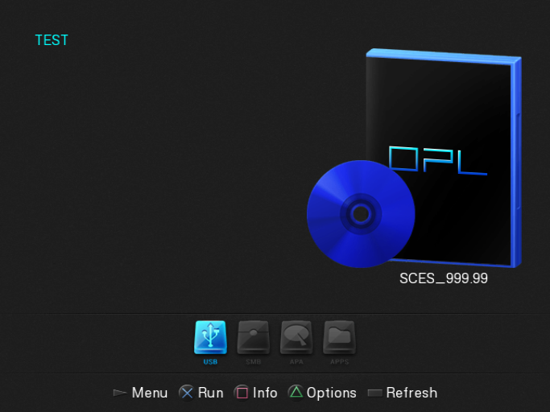
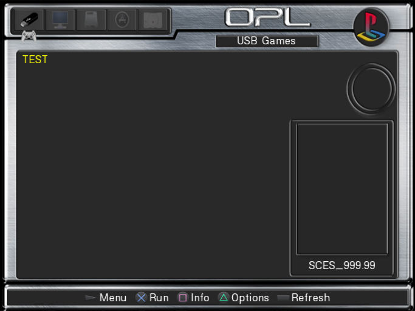
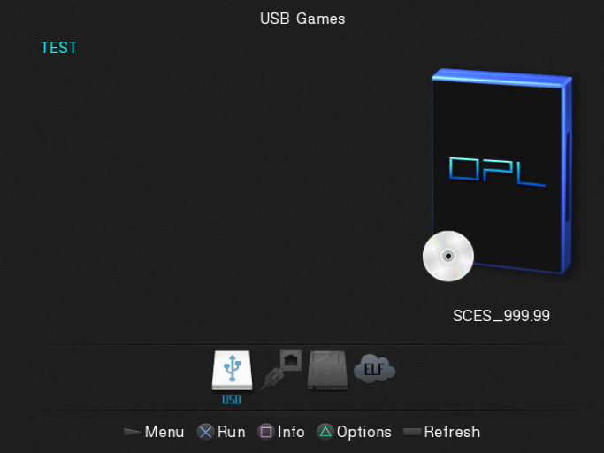
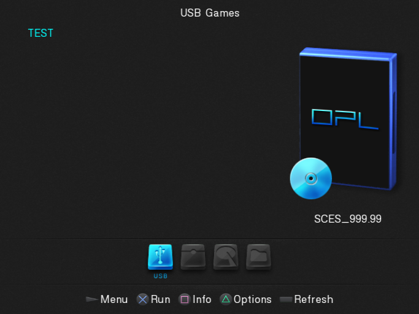
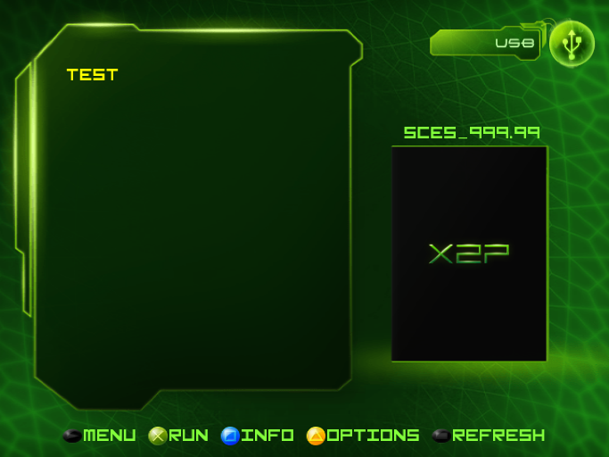
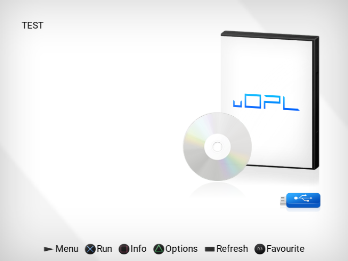
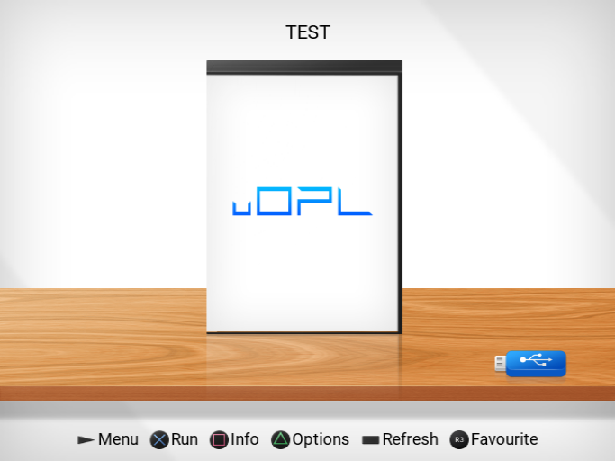
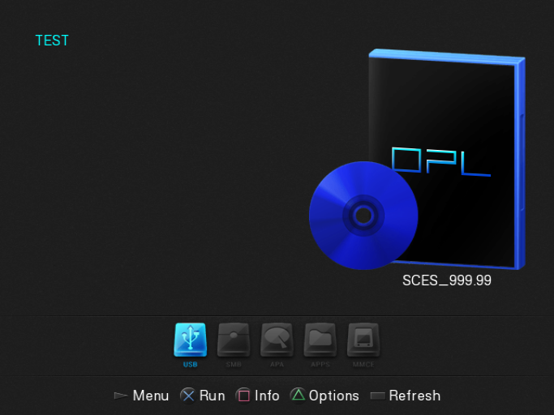

# Open PS2 Loader Flavors

The **Open PS2 Loader** project has evolved into several stable and beta versions, as well as a number of significant forks. There are now so many that it can be difficult for anyone who does not follow the PS2 homebrew scene to choose the right one. Below is a list of OPL versions in the order in which the projects first appeared, along with a brief description of how each differs from the others.

*The short name for **Open PS2 Loader** is **OPL**, but you may also come across **OPNPS2LD**. Both are correct.*

---

## Open PS2 Loader

This is the official **OPL**. Due to the nature of the PlayStation 2, it is worth keeping multiple versions because they differ in game compatibility, especially when using features such as IGR, IGS, GSM, PADEMU, and VMC. The following versions are particularly worth keeping:

- 0.9.3
- 1.1.0
- 1.2.0 beta (build 2049)
- 1.2.0 beta (build 2241)
- 1.2.0 beta (latest build)

#### Main Changes

Version 1.0.0 added support for **[MX4SIO](https://www.trisaster.de/page/index.php?topic=575)** and significantly improved game compatibility. Version 1.1.0 added support for **[i.Link](https://en.wikipedia.org/wiki/I.link)** and the `hdd0:/__common/OPL/conf_hdd.cfg` configuration file, which specifies the path to the resource partition (by default, `hdd0:/+OPL`). Version 1.2.0 introduced many major features, including an **[NBD](https://en.wikipedia.org/wiki/Network_block_device)** server (build 1635), **ZSO** disc image support (build 1871), support for the **exFAT** file system and the **GPT** partition table (build 1987, with internal HDD support added in build 2184), and **[APA-Jail](https://www.psx-place.com/resources/ps2-hdd-decryption-helper.1507/)** support. A complete changelog for each build is available inside the release archive.

#### Which Archive Should I Download?

The `OPNPS2LD.7z` archive contains the compressed all-in-one package. The archive with `VARIANTS*` contains all uncompressed revisions of a specific build (for example, with different feature sets). The remaining archives contain the source code, language files, and direct-link files for automatic updates.

#### Download Links

- [Official repository](https://github.com/ps2homebrew/Open-PS2-Loader/releases)
- [All builds](https://mega.nz/folder/Ndwi1bAK#oLWNhH_g-h0p4BoT4c556A/folder/FR4Q3YgC)

---

## E2OPL

A fork that adds support for the **EXT2** file system, based on (if I remember correctly) OPL v0.9.3.

#### Version

- 0.1.1

#### Unique Features

- EXT2 file system support.
- No need to defragment disc images stored on an EXT2 file system.

#### Download Links

- [Official repository](https://sourceforge.net/projects/e2opl/files/)

---

## Open PS2 Loader Daily Build

Also known as **OPL DB** or **OPL TA**. Although the name suggests that it is the official OPL and, moreover, the latest version, it is actually a fork of OPL. Furthermore, it is not well regarded within the PS2 homebrew scene (although it unfortunately remains very popular on YouTube, Reddit, and among sellers). This is because it integrates [POPStarter](https://www.psx-place.com/resources/popstarter.683/) against its author's wishes, includes a number of problematic code changes that introduce issues not present in OPL or other forks (for example, lower compatibility, VRAM problems, and random zeroing of VMC files), and uses a plagiarized theme containing bitmaps owned by Apple. The author has also repeatedly made false claims about OPL DB, so you may come across information on the internet that contradicts the points above...

#### Versions Not Worth Owning ;)

- 10th Anniversary Rev1875 (marketed as **10th Anniversary**, hence the names **OPL DB TA** and **OPL TA**)
- latest build

#### Unique Features

- Due to the integrated **POPStarter**, it includes an **ELM** category that lists PS1 disc images. While this is an important feature for many users, please note that official OPL can achieve the same result, although not through a dedicated category, but via **APPS**. Not to mention **POPSLoader**.
- Additional theme assets (for example, a third screenshot frame and a game logo).

#### Download Links

- [Official repository](https://github.com/Jay-Jay-OPL/OPL-Daily-Builds/releases)

---

## Open PS2 Loader v1-MOD

A fork based on OPL v1.0.0, with some changes from more recent versions backported.

#### Version

- 2024-05-16

#### Unique Features

- Supports PS3 guitars.
- Enables booting games via **OPL-Launcher** on DESR models.

#### Download Links

- [Official repository](https://github.com/SvenGDK/Open-PS2-Loader/releases)

---

## Open PS2 Loader Modular PADEMU

An OPL fork with Xbox 360 controller support. Unfortunately, it remains unfinished and only the source code is available.

#### Download Links

- [Official repository](https://github.com/belek666/Open-PS2-Loader/tree/modularPademu)

---

## Open PS2 Loader Grimdoomer

Also known as **OPL GD** (an unofficial abbreviation). A fork focused on support for internal hard drives formatted with MBR, GPT, or no partition table, using the exFAT file system.

#### Versions

- 1.2.0.6-1996 Beta
- 1.2.0.6-1996 Beta (PADEMU)
- 1.2.0.6-1996 Beta (UDMA+, which enables UDMA5/UDMA6 support)

#### Unique Features

- Support for exFAT and GPT. (later incorporated into OPL v1.2.0, and therefore available in all forks based on it)

#### Download Links

- [Official repository](https://github.com/grimdoomer/Open-PS2-Loader/releases)
- [Official forum thread](https://www.psx-place.com/threads/testers-needed-opl-internal-exfat-2tb-hdd-and-multi-bdm-devices.40018/)

---

## X2P

**Xbox-to-PlayStation** is a fork based on OPL 1.2.0 Beta build **2081**. Although it started as an April Fools' Day joke (X2P pretends to be an Xbox Classic emulator for the PS2), it is still a full-fledged OPL that can be used almost like any other version (the main differences are the folder names for covers, disc images, and so on).

#### Version

- 0.5.4 alpha 17022 REV5

#### Download Links

- [Official repository](https://github.com/koraxial/Xbox-2-PlayStation-Emulator-AlFa/releases)

---

## unofficial Open PS2 Loader

Also known as **uOPL**. A fork based on OPL v1.2.0 beta build 2049, but backported to PS2SDK v1.0.

#### Versions

- 2024-12-23
- 2024-12-23 Betrayal (replaced the gray-and-white background with a black one; not recommended :P)

#### Unique Features

- Added a **Favourites** category. (later incorporated into **wOPL** and **RiptOPL**)
- BDM HDD and APA-Jail support. (later incorporated into OPL v1.2.0, and therefore available in all forks based on it)
- Support for multiple partitions and multiple BDM devices simultaneously. (later incorporated into OPL v1.2.0, and therefore available in all forks based on it)
- Cover Flow-style theme. (later incorporated into **wOPL** and **RiptOPL**)

#### Download Links

- Official repository (removed)
- [Mirror 1](https://www.psx-place.com/resources/abandoned-unofficial-open-ps2-loader-uopl.1523)
- [Mirror 2](https://github.com/NathanNeurotic/uOPL/releases)

 

---

## Open PS2 Loader MMCE

Also known as **OPL MMCE**. A fork dedicated to Multi-purpose Memory Card Emulators (MMCE) such as **[SD2PSX](https://sd2psx.net/)**, **[Bitfunx PSxMemCard Gen2](https://www.bitfunx.com/product/psxmemcard-gen2-memory-card-for-playstation1-ps-one-playstation2-game-consoles/)** (PSXMCG2), **[Kaico SD2psx](https://kaicolabs.com/product/kaico-sd2psx/)** (SD2psx), or **[8BitMods MemCard PRO2](https://www.8bitmods.wiki/memcard-pro2)** (MCP2).

#### Versions

- beta2 and beta3 (beta3 is based on a slightly newer OPL build and also includes the correct MMCE icon)
- beta2 HDD Fix (beta2 with proper support for BDM HDD and APA)

#### Unique Features

- Automatically switches the virtual PS2 memory card to match the game's GameID. (later incorporated into many OPL forks)
- Allows loading disc images from a microSD card inserted into the MMCE. (later incorporated into many OPL forks)

#### Download Links

- [Official repository](https://github.com/ps2-mmce/Open-PS2-Loader/releases)

---

## Double Unofficial Open PS2 Loader

Also known as **wOPL**. A fork based on uOPL that expands upon it even further. It is widely considered one of the two best OPL forks available today.

#### Versions

- 2.0
- always latest build

#### Unique Features

- Separated game configs from game info data (since version 2.0 beta).
- New third menu-style view (since version 2.0 beta).
- New, reorganized, and refactored Settings menu (since version 2.0 beta).
- Ability to launch games using **Neutrino**.

#### Download Links

- [Official repository](https://github.com/ps2homebrew/wOPL/releases)

	 
	 
	

---

## Double Unofficial Open PS2 Loader: Ridge Racer V Edition

Also known as **wOPL RRVE**. A fork of wOPL focused on **Ridge Racer V**.

#### Versions

- 2025-05-18

#### Unique Features

- **neGcon** emulation for other controllers.
- **DualSense** controller support (often informally referred to as "DualShock 5").
- **Logitech DriveFX** wheel support.

#### Download Links

- [Official repository](https://github.com/exaconn/Open-PS2-Loader)

---

## Stable Open PS2 Loader

Also known as **sOPL**. A project aimed at addressing the shortcomings of the current OPL 1.2.0 beta builds. The developer abandoned the project and joined the **wOPL** development team.

#### Versions

- 2026-07-06

#### Unique Features

- Support for **TAR** archives that can be used to package the ART, CFG, and CHT folders. (later incorporated into **wOPL** and **RiptOPL**)

#### Download Links

- [Official repository](https://github.com/mystyq/Stable-Open-PS2-Loader/releases)

---

## RiptOPL

A project aimed at combining features from all major OPL forks. It is one of the two best OPL forks currently available.

#### Versions

- Always latest build.

#### Unique Features

- Combines features from multiple OPL forks.

#### Download Links

- [Official repository](https://github.com/NathanNeurotic/Open-PS2-Loader/releases)

---

## PS2 Launcher

A fork based on one of the OPL 1.2.0 beta builds, with a modified GUI that mimics the PlayStation 5 Dynamic Menu.

#### Versions

- Always latest build.

#### Unique Features

- PS5-style menu.

#### Download Links

- [Official repository](https://github.com/Irfanlesnar/PS2-Launcher/releases)

---

## OPL-Evolution

A fork based on one of the OPL 1.2.0 beta builds, with a modified GUI that resembles a dashboard.

#### Versions

- 0.27.0-alpha

#### Unique Features

- Dashboard-style menu.

#### Download Links

- [Official repository](https://github.com/officialjuicedesigns/OPL-Evolution/releases)

---

## Awaiting Comparison

The following OPL-derived projects and feature branches have been identified but have not yet been fully tested and compared against the entries above. They are listed here as research targets for a future update rather than as recommendations.

- [Open PS2 Loader HTTP — Docmine17/Open-PS2-Loader-HTTP](https://github.com/Docmine17/Open-PS2-Loader-HTTP) — native HTTP Range Request game streaming.
- [Open PS2 Loader + RetroAchievements — hacan359/Open-PS2-Loader (`ra` branch)](https://github.com/hacan359/Open-PS2-Loader/tree/ra) — xeRAbora/RetroAchievements integration.
- [Open PS2 Loader Retro-GEM — CosmicScale/Open-PS2-Loader-Retro-GEM](https://github.com/CosmicScale/Open-PS2-Loader-Retro-GEM) — Retro GEM Game ID support.
- [GameID + GEM — AppCakeLtd/Open-PS2-Loader (`gameid-with-gem` branch)](https://github.com/AppCakeLtd/Open-PS2-Loader/tree/gameid-with-gem) — GameID/GEM feature branch used by related Retro-GEM work.
- [Open PS2 Loader UDPBD — tihmstar/Open-PS2-Loader (`udpbd` branch)](https://github.com/tihmstar/Open-PS2-Loader/tree/udpbd) — UDPBD network-storage variant.
- [Open PS2 Loader Extended APA — L10N37/Open-PS2-Loader-Extended-APA](https://github.com/L10N37/Open-PS2-Loader-Extended-APA) — banked APA support for internal HDD storage beyond 2 TiB.
- [OPLattice — coffeedevsolutions/OPLattice](https://github.com/coffeedevsolutions/OPLattice) — custom OPL build and patch set centered on the SHELF/sidebar and grid-style interface.
- [OPL FUTURE — brunlx/OPL-Future---BETA](https://github.com/brunlx/OPL-Future---BETA) — redesigned frontend with carousel, device dock, and status HUD.
- [Open PS2 Loader CoinTimer — nk357156-dev/Open-PS2-Loader-CoinTimer](https://github.com/nk357156-dev/Open-PS2-Loader-CoinTimer) — Arduino coin-timer support over UDP with an on-screen overlay.

---

 Berion 2026-08-05

<small>➜ Go back to <a href="{{ site.baseurl }}/">main page</a></small>

