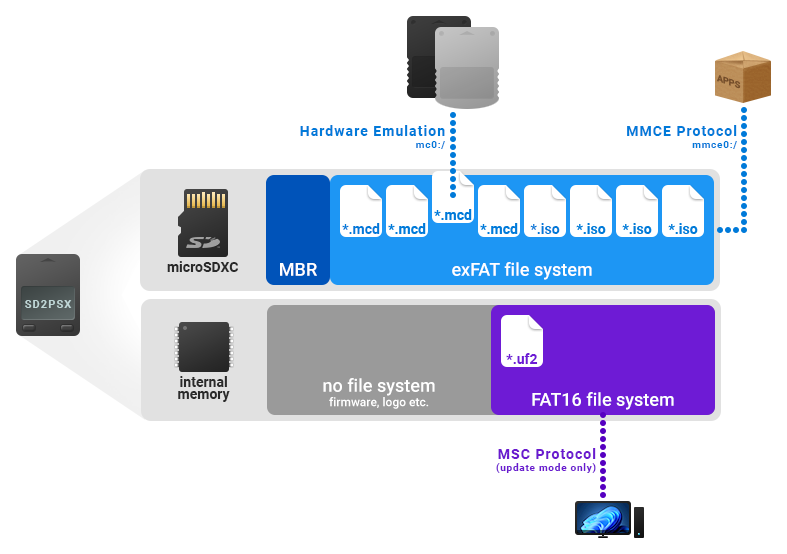
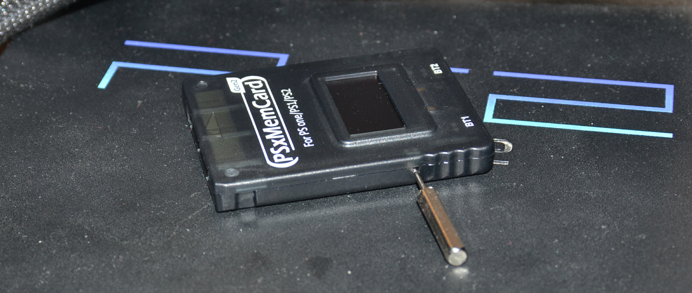
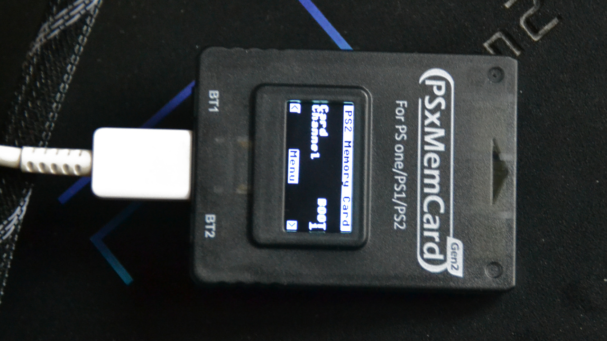
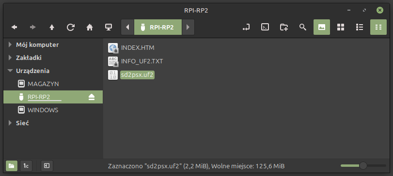
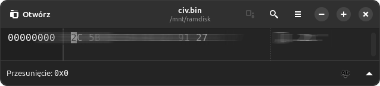
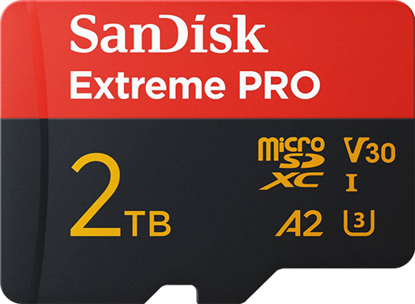
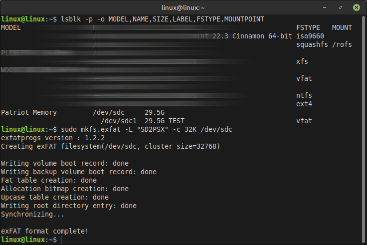
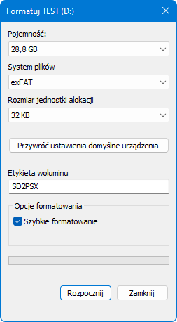
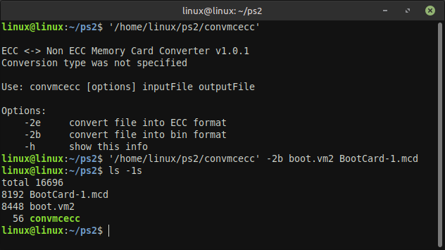
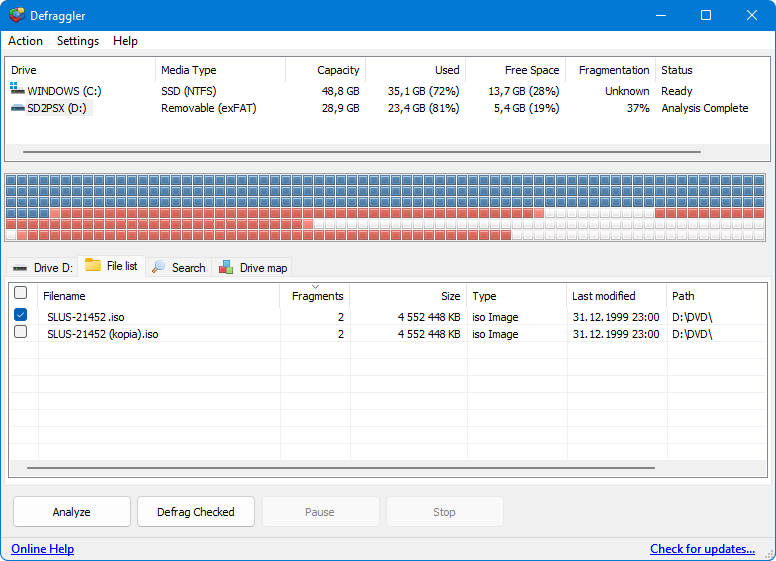

# Everything You Need to Know About SD2PSX

[SD2PSX](https://sd2psx.net/) is the first memory card emulator in the history of the so-called PlayStation 2 scene. <span style="color: #D32F2F;">It works on literally every PS2 model (SCPH, DESR, KDL, DTL-H, COH) and every console firmware version.</span> The **MMCE** (**M**ultipurpose **M**emory **C**ard **E**mulator) makes it possible to use a virtual card stored on a **microSD**, which is recognized by the console as a genuine **PlayStation Memory Card**, **PlayStation 2 Memory Card**, or **Arcade Dongle**, including support for **MagicGate** authentication. What's more, MMCE can also be used <span style="color: #D32F2F;">simultaneously</span> as the storage medium from which a game disc image is loaded.

<p align="center"></p>

While SD2PSX is a DIY project (i.e., it has to be built by hand), there are several factory-manufactured variants available commercially. Everything you can read in this guide applies to the entire MMCE family, with the exception of firmware updates (MemCard PRO2 has its own firmware), as well as the naming and placement of files and folders on the microSD. SD2PSX does not have any network functionality, so I will also omit this aspect from the guide.

### Factory-manufactured SD2PSX variants:

- [Bitfunx PSxMemCard Gen2](https://www.bitfunxshop.com/products/bitfunx-psxmemcard-gen2-for-ps1-psone-and-ps2-games-memory-cards)
- [Kaico SD2psx](https://kaicolabs.com/product/kaico-sd2psx/)
- [LinkRetro SD2PSXTD](https://pl.aliexpress.com/item/1005012759346025.html)

### Other manufactured MMCE not compatible with SD2PSX:

- [8BitMods MemCard PRO2](https://8bitmods.com/memcard-pro2-for-ps2-and-ps1-charcoal-black/)

### Not an MMCE:

- [MX4SIO](https://www.trisaster.de/page/index.php?topic=575), its clones (such as **MC2SIO**), as well as an SDXC card soldered directly to the console's motherboard or the memory card PCB, are not emulators! While they use the same port as MMCE and real memory cards, they are closer to a USB stick, except that they are connected to SIO2 rather than USB. MX4SIO is not an MMCE device!

<p align="center"></p>

<span style="color: #D32F2F;">**WARNING:** On the PlayStation (PS1), an MMCE must not be connected while it is in PlayStation 2 Memory Card emulation mode. This mode can be selected in the physical device settings, but the device must not be connected to a PlayStation while this mode is enabled. Doing so can damage the PlayStation's SIO controller and/or the MMCE itself! Also, do not use dynamic mode with a PS1 multitap, as this will damage the PS1 multitap device.</span>

## Terminology

All the mysterious acronyms, abbreviations, and terms I use throughout this guide you can find in the [glossary](Glossary.md).

## Firmware Update

**1.** Your MMCE most likely arrived with the default, and therefore outdated, firmware. [Download](https://github.com/sd2psXtd/firmware/releases) the latest stable version from the **sd2psXtd repository**, i.e. the `sd2psx.uf2` file.

**2.** Take a close look at the PSXMCG2/SD2psx -- there should be a small hole on one of its sides with a special button inside. Press and hold it for a moment, then, without releasing it, connect the device to your computer using a **USB-C** cable (<span style="color: #D32F2F;">it must support data transfer; a charging-only cable will not work!</span>). Alternatively, instead of pressing and holding the side button, you can press and hold both front buttons (BT1 and BT2), or just one of them.

<p align="center"></p>

If you did this <span style="color: #D32F2F;">**INCORRECTLY**</span>, <span style="color: #D32F2F;">the card will display its normal menu</span>, just as it does when connected to the console. In that case, disconnect the PSXMCG2 and try again.

<p align="center"></p>

If you did this <span style="color: #018000;">**CORRECTLY**</span>, <span style="color: #018000;">the display will remain blank</span>, but you should see a new device named **RPI-RP2** in your computer's file manager.

**3.** Mount **RPI-RP2** and copy the `sd2psx.uf2` file to it. Once the transfer is complete, the PSXMCG2 will update automatically and the device will disappear.

The screenshot below was taken on **Linux**, but the procedure and the emulator's behavior are exactly the same on **Windows**.

<p align="center"></p>

<span style="color: #D32F2F;">**Note:**</span> RPI-RP2 is not the microSD card, but a separate area of the internal storage. Therefore, the microSD card is not required for the update, and it does not matter whether it is inserted or not.

The USB connection <span style="color: #D32F2F;">is used exclusively</span> for firmware updates. To manage games or virtual memory cards (memory card images), you must remove the microSD card and connect it to your computer using a microSD card reader. There is also no PS2 application that can copy a game from an optical disc to a disc image on the microSD card.

## Challenge IV

To use PlayStation 2 Memory Card emulation mode, a **CIV** must be installed on the MMCE. It is one of the keys involved in the authentication of the infamous **MagicGate**. Since Sony considers itself the owner of certain numbers, as confirmed by lawyers and courts, I cannot provide the complete sequence of values. You will have to [find it on the internet](https://html.duckduckgo.com/html?q=sd2psx%20%22civ.bin%22%20file%20download) yourself. ;)

<p align="center"></p>

`CIV.BIN` is a binary file and should be copied to the root of the microSD card. The firmware should automatically move this file to its internal storage (which you can verify using the **wLE ISR** or **wLE R3Z** by checking `mmce0:/`). If this does not happen, boot the PS2 with the MMCE connected, go to the "PS2 Settings", and select the "Deploy CIV.BIN" option.

Most SD2PSX manufacturers sell the emulator with the CIV already installed, but if you built the SD2PSX yourself, you will of course have to take care of the CIV yourself.

## Button Controls

The device has two buttons on the front, labeled BT1 and BT2, which are used to navigate the menu, switch between channels, and perform other functions.

| | |
|-|-|
| Switching between channels: | Short press BT1/BT2 (previous/next) |
| Switching between VMCs:     | Long press BT1/BT2 (previous/next) |
| Settings menu:              | Press BT1 and BT2 simultaneously |
| Navigating the settings:    | Short press BT1/BT2 (up/down) |
| Confirm:                    | Long press BT2 |
| Back:                       | Long press BT1 |

If the user switches to a non-existent channel or VMC, a new VMC will be automatically created on the microSD card with the configured size (8 MiB by default -- this value should not be changed to a smaller or larger size, as some games will then fail to detect the memory card).

There is no way to delete a VMC other than using a microSD card reader, e.g. on a computer or via wLE ISR/wLE R3Z on the PS2.

## What Kind of microSD Can Be Used?

Advertised read/write speed is not particularly important for the PS2 (because even the lowest-quality SD card you can buy in a store will still be faster than the bandwidth of SIO2). However, what matters more is how well the card performs over the SPI interface, especially its sustained transfer rate and latency during random access. There may also be other factors that can make a card incompatible, which we are currently unaware of (similar to what happens with MX4SIO). The [SD Association's guide](https://www.sdcard.org/consumers/about-sd-memory-card-choices/) explains the various markings found on SD cards. Keep in mind, however, that these ratings do not necessarily indicate how well a particular card will perform in an MMCE. In practice, **A1** and **A2** cards tend to work best with MMCE.

If you intend to use the MMCE exclusively as a PSXMC/PS2MC emulator, the microSD card does not matter at all. Almost any card will work just as well. <span style="color: #D32F2F;">However, if you also intend to play games from the MMCE, it turns out that the microSD card needs to be of very good quality. Otherwise, most games will suffer from stuttering!</span>

A recommended, but very expensive, card is the **SanDisk Extreme PRO A2 C10 V30 UHS-I U3** (no, this is not a sponsored product; it simply works :P).

<p align="center"></p>

<span style="color: #D32F2F;">**WARNING:**</span> On <span style="color: #D32F2F;">SCPH-75xxx / 77xxx / 79xxx / 90xxx models</span>, all MMCE devices are several hundred KiB/s slower (~1.7 MiB/s on SCPH models up to and including 70K, and ~1.3 MiB/s on newer models). This may be because SIO2 (the port to which memory cards, their emulators, and MX4SIO are connected) is slower on these models, or it may be some kind of issue related to [Deckard](https://www.psdevwiki.com/ps2/Deckard) and SIO2 handling.

## Formatting the microSD Card

The sd2psXtd firmware (up to and including version **1.4.0**) supports only the **MBR** partition table format (so **GPT** cannot be used, nor can the card be used without a partition table). The supported file systems are **FAT32** and **exFAT** (FAT32 limits the user to a maximum file size of ~4 GiB, so I do not recommend it). Maximum card capacity is **2 TiB** (not because of MBR, but because of a hardware limitation of the SD2PSX itself).

The latest versions of OPL and NTR do support everything mentioned above, but this does not matter because sd2psXtd will not recognize the contents of the SD card. For the same reason, OPL and NTR inherit the MMCE limitations when used with an MMCE (and only when used with an MMCE).

In addition to the appropriate partition table and file system, the **cluster size** is also important (<span style="color: #D32F2F;">do not confuse it with the sector size; they are completely different things</span>). The optimal size for the drivers on the PS2 side is **32 KiB**, 64 KiB is the maximum, and 4 KiB is the minimum.

### Linux

Formatting a card on Linux using the GUI looks different in each desktop environment (assuming your DE provides such functionality at all). [GParted](https://gparted.org/) is one example of a GUI application that can be used for this, but formatting from the terminal ensures that the process will be the same on every distribution.

```bash
lsblk -p -o MODEL,NAME,SIZE,LABEL,FSTYPE,MOUNTPOINT
sudo umount -l /dev/sdx1
sudo parted --script /dev/sdx mklabel msdos mkpart primary exfat 1MiB 100%
sudo partprobe /dev/sdx
sudo mkfs.exfat -L "SD2PSX" -c 32K /dev/sdx1
```

- Replace `sdx` with your card's device name (e.g. `sdc` on your system).
- `lsblk` helps you determine which device the microSD card is assigned to.
- Many desktop environments automatically mount recognized file systems by default, just like Windows does, hence the presence of `umount`.
- Some distributions will not automatically detect changes made to the storage device, so after creating the MBR partition table, you can use `partprobe`.

<p align="center">
	
	<br />
	<span style="font-size: 80%;">Latest sd2psXtd firmware supporting microSD without a partition table.</span>
</p>

### Windows

Formatting a card on Windows is just as easy as it can be done directly from **File Explorer** (called **Windows Explorer** in Windows 7 and earlier). Simply right-click the device and select the "Format..." option. A new window will appear, where you can select the exFAT file system with 32 KiB clusters.

If you want to completely wipe the card, uncheck the "Quick Format" option. This will, of course, significantly increase the time required to complete the process because a quick format overwrites only a few hundred KiB of file system metadata, whereas a full format overwrites every sector on the card.

<p align="center"></p>

If File Explorer refuses to cooperate, you can also use [diskmgmt.msc](https://support.microsoft.com/pl-pl/windows/zarządzanie-dyskami-w-systemie-windows-ad88ba19-f0d3-0809-7889-830f63e94405) or a program such as [Rufus](https://rufus.ie/en/).

## Directory Structure and File Formats

All MMCE devices support virtual memory cards (throughout the guide, I also use the abbreviation **VMC** or the term **memory card image** -- all three terms can be used interchangeably because they refer to the same data). The selected VMC is exposed by the MMCE as the one emulating a real memory card, and only this one is visible to the console. However, VMCs can be switched at any time (except, for example, when a game is currently writing data to the card) using the buttons on the device.

### Save vs. Image

A very common mistake among users is confusing memory card images with saves created by games. Games do not see files on the microSD card, nor do they understand memory card images because... they do not need to. Games only see the contents of the PS1MC/PS2MC, and that is the only thing they care about. You cannot use save containers or individual saves directly with MMCE. If you have such files, you need to import them into `*.mcd`.

### PSX VMCs

These are **raw dumps**, each exactly **128 KiB** in size. If you have an image in another format, such as `*.ddf`, `*.gme`, or `*.vmp`, you need to remove its header using a hex editor or use a program such as [MemcardRex](https://github.com/ShendoXT/memcardrex). If you have an `*.mcr`, `*.srm`, or `*.vm1` file, it is enough to rename it to `*.mcd`. If you only have individual saves (e.g. RAW, `*.mc`, `*.psv`), you need to import them into a VMC.

### PS2 VMCs

These are also **raw dumps**, but **without ECC**. This means that each one is exactly **8 MiB** in size or a multiple of that size. Smaller sizes than 8 MiB are also supported, but not recommended. Since firmware version **1.4.0**, VMCs larger than 64 MiB are also supported (up to a maximum of **1 TiB**). Keep in mind that 8 MiB refers to an image without ECC. <span style="color: #D32F2F;">Many emulators use VMCs with ECC, and these cannot be used with MMCE</span> (for example, those from PCSX2 (`*.ps2`), PS3 (`*.vm2` and `*.vme` (the latter are additionally encrypted)), PS4, and PS5). Memory card images can be easily converted, for example, using the [PS2 ECC Memory Card Converter](https://github.com/ffgriever-pl/PS2-ECC-Memory-Card-Converter) program.

<p align="center"></p>

**Note:** On Windows, open **CMD** or **PowerShell** and run the following command, assuming that the above program and the VMC are placed on the desktop: `%DESKTOP%\convmcecc.exe -2b boot.vm2 BootCard-1.mcd`.

If you have only individual saves (e.g. `*.cbs`, `*.max`, `*.psu`, `*.psv`, `*.sps`, `*.xps`), you need to import them into a VMC. Directly on the PS2, you can use [Apollo Save Tool](https://github.com/bucanero/apollo-ps2/releases) to import saves. VMCs used by **Open PS2 Loader** or **Neutrino** (and all of its launchers) use `*.bin`, which is an image without ECC and only needs to be renamed to `*.mcd`.

As you have probably already noticed, the file extension used by sd2psXtd is *.mcd. This is not a special format, but simply part of the file name.

### File Tree

Below is the directory and file structure used by the sd2psXtd firmware:

```
├── MemoryCards
│    ├── PS1
│    │    ├── BOOT
│    │    │    └── BootCard-*.mcd
│    │    └── Card*
│    │         └── Card*-*.mcd
│    └── PS2
│         ├── BOOT
│         │    └── BootCard-*.mcd
│         └── Card*
│              └── Card*-*.mcd
└── .sd2psx
     └── settings.ini
```

### Settings File

The configuration file (`settings.ini`) contains:

```
[General]
Mode=PS2
FlippedScreen=OFF
[PS1]
Autoboot=OFF
GameID=ON
[PS2]
Autoboot=ON
GameID=ON
CardSize=8
Variant=RETAIL
```
**Mode** defines the operating mode: PS1 or PS2 memory card emulation (it is not possible to emulate both at the same time because the two formats are completely different).

**FlippedScreen** controls the orientation of the image displayed on the MMCE screen: upside down or facing the user.

**Autoboot** enables automatic booting of, for example, the FreePSXBoot exploit (PS1) or anything via System Update (PS2), such as Free McBoot.

**GameID** determines whether the MMCE should create a VMC corresponding to the Game ID (if it does not already exist) or automatically switch to it (if it already exists). This is a very convenient feature that automatically gives each game its own VMC.

**CardSize** defines the card size (1 MiB, 2, 4, 8, 16, 32, 64, 128, or 256; larger sizes cannot be set in the settings file, but they are supported in the latest firmware).

**Variant** specifies the type of PS2 card being emulated (`RETAIL`, `ARCADE`, or `PROTO`). RETAIL refers to a standard retail card, while the others are special cards dedicated to specific PlayStation 2 models (devkits, debugkits, arcade systems, and prototype models).

All of the above settings can, of course, also be changed from the console's menu.

## Defragmentation

Although defragmentation does not play a significant role in current versions of OPL and NTR (as long as VMCs and disc images do not consist of too many fragments), it is still worth keeping fragmentation at zero whenever possible, as this eliminates delays caused by accessing sectors on the virtual disc. Defragmentation is the process of consolidating all files into contiguous blocks (it is by no means uncommon for the clusters occupied by a file, such as a disc image, to be scattered across the storage medium like manure in a field), allowing them to be read sequentially in their entirety. Under normal circumstances, such as on a PC, fragmentation is irrelevant on an SSD (and only mildly relevant on an HDD), but on the PS2, we're fighting for every millisecond we can save! ;)

### Linux

There are currently no reliable programs for defragmenting exFAT on Linux, at least none that I would recommend. If you are brave enough, you can try "defrag.exfat". ;)

### Windows

Although the built-in defragmentation tool in Windows 8.1 and earlier is not particularly efficient, I consider it good enough. The problem is that in Windows 10 and 11, it was reduced to a service. Therefore, the most convenient option is to use one of the free applications, such as [Defraggler](https://www.ccleaner.com/defraggler/builds?cc-noredirect=).

In the installer, click "Custom" and <span style="color: #D32F2F;">uncheck "Replace Windows Disk Defragmenter"</span>. After installation, launch the program, select the drive, and click the "Analyze" button. If you see any red squares, it means that the file system would benefit from defragmentation. Depending on the amount of data, the read and write speeds of the card, the interface, as well as the controllers on both ends, the process can take an extremely long time. It therefore makes much more sense to switch to "File list" and defragment only the selected files.

<p align="center"></p>

### Alternative

The defragmentation process can be very long and cumbersome, while also unnecessarily wearing out the SD card. If your file system is heavily fragmented, a much better approach would be to... copy all the files from the SD card to your computer, format the card, and then copy everything back, starting with the VMCs, followed by the disc images, and finishing with the remaining data. The main reason why this makes sense is the time saved. Keep in mind that this does not guarantee that nothing will be fragmented, as the file manager determines how files are arranged across clusters.

<br />Berion<br />2026-09-04

<p align="right"><small>➜ Go back to <a href="index.md">main page</a></small></p>
