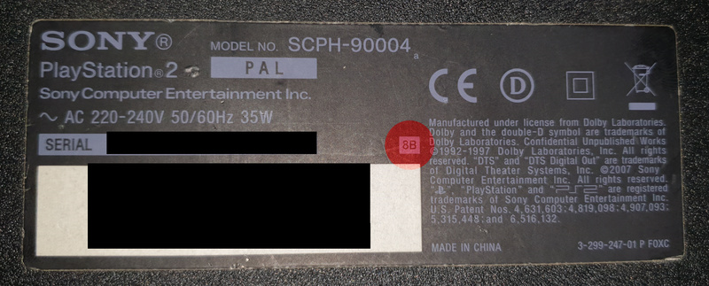
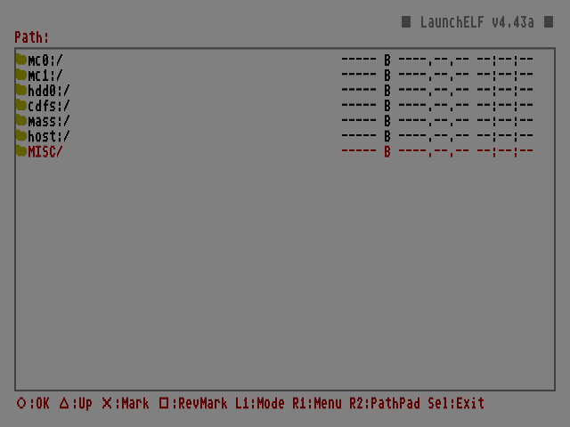
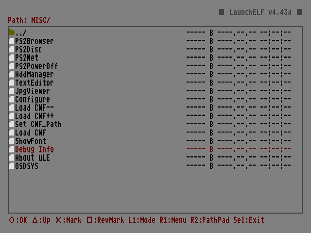
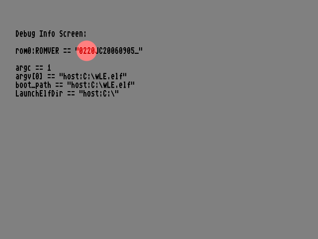

# How to Check Firmware Version

The BOOTROM version is largely irrelevant to most PS2 owners. This is because **System Update** (also known as **OSD Update**) works on almost all consoles, allowing applications such as Free McBoot to be launched automatically when the console starts. However, if the user does not have an internal hard drive and does not have a PlayStation 2 Memory Card with working MagicGate, it determines which variant of **OpenTuna** should be used (or eventually **ProtoPwn**, if they have one of the so-called protokernel models). Oh, and there are also 90K model owners. ;)

## Where to Read ROMVER

Definitely not in the PS2 Browser (the PS2 menu), as the firmware version is not displayed anywhere there. Well, to be precise: it is, but only when using OSDMenu or HOSDMenu, not in the vanilla environment, which is the case here. Generally speaking, you need to start one of the applications listed below to be able to read ROMVER (BOOTROM version):

- any unofficial LaunchELF or one of its forks (recommended [wLE R3Z](https://github.com/saildot4k/wLaunchELF_R3Z))
- [PS2Ident](https://github.com/ps2homebrew/PS2Ident)
- [OSDMenu or HOSDMenu](https://github.com/pcm720/OSDMenu)
- [ROM Version Checker](https://github.com/slimpuggamer/ROMVersionChecker)

The catch here is the chicken-and-egg scenario. To start a homebrew application, you need to have already jailbroken the PS2 in some way... But fortunately, we can easily split the model series into ranges, with one edge case:

| Version      | Model                                                               | OSD Update | OpenTuna | ProtoPwn | 
|-|-|-|-|-|
| 1.00         | SCPH-10xxx / 15xxx                                                  | ✔          |          | ✔        |
| 1.10 -- 160  | SCPH-18xxx / 3xxxx                                                  | ✔          | ✔        |          |
| 1.70         | SCPH-50xxx (early)                                                  | ✔          | ✔        |          |
| 1.80         | DESR series with fw 1.xx                                            | ✔          |          |          |
| 1.90 -- 2.20 | SCPH-50xxx (late) / 7xxxx / 9xxxx (early), DESR series with fw 2.xx | ✔          | ✔        |          |
| 2.30         | 9xxxx (late)                                                        |            | ✔        |          |
| 2.40         | -                                                                   | -          | -        | -        |
| 2.50         | KDL                                                                 |            | ✔        |          |

## SCPH-90K

Many people think that these units cannot automatically launch applications such as FMCB when the console starts. This is only true for the 90K series with BOOTROM **2.30**. Early 90K units that left the factory were shipped with version **2.20** installed, which still has the System Update feature enabled.

In theory, if the code **8B** is shown on the label next to the model number on the console's casing, then and only then does the PS2 have version 2.20 (**8C** can vary, while all **8D** units have version 2.30). However, this is not a reliable indicator, as the motherboards may have been swapped...

The **only** 100% reliable test is to boot a disc with [FreeDVDBoot](https://github.com/CTurt/FreeDVDBoot) (by the way, owners of older models can use [FreeDVDBoot-2.13E](https://github.com/VINSERTF128/FreeDVDBoot-2.13E) or [YADE](https://github.com/MFDGaming/YADE/)), which will automatically launch wLE. In the file manager, go to "MISC", then "Debug Info", and if you see 0230 next to "ROMVER" -- you're out of luck. If you see 0220 -- congratulations. :)

	   
	

## Updating BOOTROM

Updating the BOOTROM is impossible because it is stored on a ROM chip, which means it is read-only.

 Berion 2026-09-19

<small>➜ Go back to <a href="{{ site.baseurl }}/">main page</a></small>

