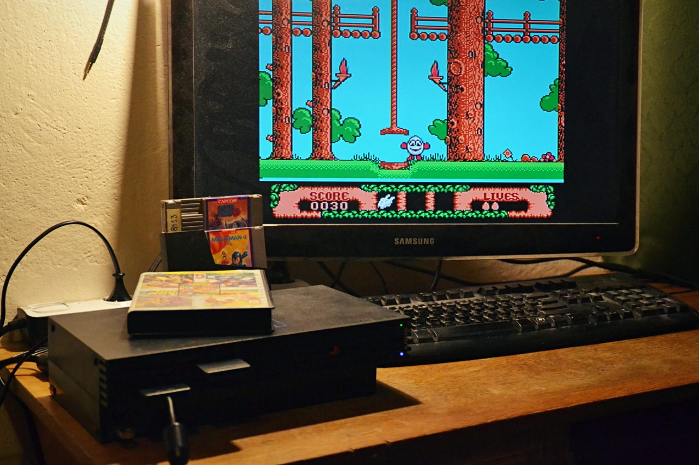

# How to Hack PlayStation 2 in 2026

It is now **late 2026**, and there are still enthusiasts around the world who are willing not only to play on such an ancient console, but also to look for new ways to exploit it, write and improve homebrew programs. If you are a new user, you have probably already dug through tons of articles and guides (usually heavily outdated, as they are at least a decade old), and the sheer amount of information may leave you feeling confused.

No worries! I have prepared this roadmap specifically for you. It will not guide you step by step because it is not a detailed guide, but it will show you what options are available and which path you should take based on the PS2 model and accessories you have. As of today, these are all known public methods, categorized and sorted alphabetically.

## A. Optical Disc

### Boot Disc

Pressed discs, meaning CD-ROMs or DVD-ROMs with cloned security features (so they must necessarily be original and from the same region as the console; CD-R or DVD-/+R copies **will not** work), which can be used, for example, to cheat in games, transfer saves to a Memory Card, or launch programs from a USB stick. The most popular ones are **Action Replay**, **Code Breaker**, **GameShark**, and **Swap Magic**. As an attack vector, the most useful among these is Swap Magic 3.6 or 3.7, because it can launch applications from USB. In second place are Action Replay MAX and Code Breaker 9 or 10, which allow importing a save from USB to PS2MC, so [Fortuna]() or [OpenTuna]() can be prepared inside them.

| | |
|-|-|
| It works on:    | all SCPH, DESR and KDL models |
| It works from:  | PS2CD-ROM or PS2DVD-ROM |
| Recommendation: | no, because there are simpler methods and it is difficult to buy these programs at a reasonable price today |
| Permanent:      | no |

### FreeDVDBoot

[FDVDB](https://github.com/CTurt/FreeDVDBoot) is an exploit targeting [specific versions](https://www.psdevwiki.com/ps2/FreeDVDBoot_Compatibility_List) of the **DVD-Video Player** (the version can be checked in the PS2 Browser). However, the system language must be set to English.

| | |
|-|-|
| It works on:    | all SCPH and KDL models with DVD-Player in versions: 3.10 and 3.11 |
| It works from:  | DVD-R, DVD+R or DVD+M |
| Recommendation: | yes |
| Permanent:      | no |

### FreeDVDBoot-2.13E

The unofficial [fork of FDVDB](https://github.com/VINSERTF128/FreeDVDBoot-2.13E) works in the same way as FDVDB, with the difference that covering **DVD-Video Player** in version 2.13E. System language must be set to English.

| | |
|-|-|
| It works on:    | all SCPH models with DVD-Player in version: 2.13E |
| It works from:  | DVD-R, DVD+R or DVD+M |
| Recommendation: | yes |
| Permanent:      | no |

### Swap Trick

Disc swapping is replacing an original game disc with a modified copy in which the executable responsible for the online mode (the PS2 has only 32 MiB of RAM, so game developers often used different executable files for single-player and online modes) could be replaced with, for example, a file manager. This method requires blocking the lid-open sensors (on "Slim" models) or forcibly pulling out the tray (on "Fat" models), because pressing the eject button interrupts the read operation, while the goal is to prevent the console from knowing that the user has swapped the disc. Without blocking the sensors or abusing the tray, this can only be done with the console disassembled.

| | |
|-|-|
| It works on:    | all SCPH models |
| It works from:  | PS2CD-ROM or PS2DVD-ROM with CD-R, DVD-R, DVD+R or DVD+M |
| Recommendation: | no, because it is cumbersome (on "Fat"/"Slim") and damages the disc tray mechanism (on "Fat") |
| Permanent:      | no, the lid-open sensors can be removed |

### Yabasic

An exploit targeting Basic, specifically [Yabasic](https://en.wikipedia.org/wiki/Yabasic), which was bundled with the console demo disc. It is an interesting attack vector, as at least a quarter of PS2 owners have such an original disc containing demos and the Basic interpreter. So far, the idea has not progressed beyond the [proof-of-concept](https://cturt.github.io/ps2-yabasic.html) stage (meaning that it works, but is not ready for use by the average console user). Not all versions of Yabasic are vulnerable, and the demos bundled with the program were only included in the PAL and NTSC-J regions.

| | |
|-|-|
| It works on:    | all PAL and NTSC-J SCPH models |
| It works from:  | PS2CD-ROM |
| Recommendation: | no, unless you are a masochist or have a penchant for writing epistles |
| Permanent:      | no |

### Yet Another DVD Exploit

[YADE](https://github.com/MFDGaming/YADE), as the name suggests, is yet another exploit targeting the **DVD-Video Player**.

| | |
|-|-|
| It works on:    | SCPH models with DVD Player versions: 3.00A/E/J/U, 3.02C/D/E/G/J/K/U, 3.03E/J, 3.04J/M |
| It works from:  | DVD-R, DVD+R or DVD+M |
| Recommendation: | yes |
| Permanent:      | no |

## B. Internal Memory Card

That is, the built-in flash memory in each DESR model (mounted at `xfrom0:/`). I use the term "internal Memory Card" not only because of its capacity (8 MiB) and the fact that it uses the same MCFS file system as a PS2 Memory Card, but also to avoid distinguishing between different types of internal storage (flash, HDD, etc.).

Additionally, `xfrom0:/` may become usable on SCPH-50K models in the future through a custom Network Adaptor with flash memory, as their firmware already supports it.

### XOSDMBR

[XOSDMBR](https://github.com/pcm720/OSDMenu) is a bootloader that replaces `xfrom0:/xosdmain.elf`, allowing the user to launch any program (e.g. from `xfrom0:/`, `usb:/`, etc.), and even [OSDMenu](https://github.com/pcm720/OSDMenu) (requires OSDSYS from SCPH models). All of this without the need for a Memory Card containing something like FMCB, as was the case in the past.

| | |
|-|-|
| It works on:    | all DESR models |
| It works from:  | internal flash |
| Recommendation: | yes |
| Permanent:      | no, but cannot be easily removed |

## C. External Memory Card or Its Emulator (PS2MC/MMCE)

The list does not include **PS1 environment** exploits, namely [Free PSX Boot](https://github.com/brad-lin/FreePSXBoot), [TonyHax](https://github.com/socram8888/tonyhax), and [TonyHax International](https://alex-free.github.io/tonyhax-international/), because they cannot be used to hack the **PS2 environment**, or at least nobody has yet figured out a way to escape from PS1 Mode (theoretically, this may even be impossible). They also all work exclusively with PS1MC (a Memory Card for PlayStation/PlayStation One).

**MMCE** (**M**ultipurpose **M**emory**C**ard **E**mulator), as the name suggests, is a device that emulates memory cards and, among other things, allows you to select an image (PS1MC/PS2MC) to be presented as a physical card. Therefore, everything in this section that applies to a physical card also applies to MMCE devices. You can read more about MMCE in the dedicated guide: [Everything You Need to Know About SD2PSX](Everything%20You%20Need%20to%20Know%20About%20SD2PSX.md).

If you have a [PS3 Memory Card Adaptor](https://www.psdevwiki.com/ps3/Card_Adapter) (it must be the original one), you can also transfer anything you want to the Memory Card directly from a PC using the dedicated PS3MCA Tool (no link because it was taken down following a DMCA request) and, of course, the appropriate drivers for the device (Windows/Linux).

### Fortuna / OpenTuna

[Fortuna](https://www.ps2-home.com/forum/viewtopic.php?t=8542) is an exploit targeting the save icon parser in the PS2 Browser. It requires the user to view the save and return to the main menu, which automatically launches the program hidden inside the supposed icon. Unfortunately, the hack will not work if the save does not have the most recent timestamp. Fortuna supports only all "Slim" models, but an open-source fork called [OpenTuna](https://www.psx-place.com/threads/opentuna-an-open-source-version-of-fortuna-based-on-reverse-engineering.33010/) was created that covers a wider range of consoles.

Users of SCPH-90K series with firmware v2.**3**0, or those whose Memory Cards do not support Magic Gate, who would like to have OSDSYS Patcher, can install it by [RipTUNA Installer]() or use PSUja project (included in [R4D](https://www.psx-place.com/resources/recovery-for-dummies.1520/) v3.0 and newer).

Note: [FunTuna](https://www.psx-place.com/threads/funtuna-free-mcboot-for-fortuna.30973/) is OpenTuna that launches FMCB, but it is outdated and no longer recommended.

| | |
|-|-|
| It works on:    | SCPH-30K/50K/70K/90K series |
| It works from:  | PS2MC |
| Recommendation: | yes, if you have fw v2.30 or newer |
| Permanent:      | no |

### ProtoPwn

[ProtoPwn](https://github.com/pcm720/protopwn) is an exploit targeting MBROWS, which is present exclusively in models with the so-called proto kernel. It does not use the System Update mechanism, so a Memory Card with Magic Gate is not required.

| | |
|-|-|
| It works on:    | SCPH-10000, SCPH-15000, DTL-H10000(S) |
| It works from:  | PS2MC in any slot |
| Recommendation: | yes |
| Permanent:      | no |

### PS2 Independence

An exploit that takes advantage of a bug in the parsing of the configuration file `title.db` in the PlayStation One emulator. Similarly to the Swap Trick, this method requires messing around with the disc tray/lid sensors and additionally requires an original PS1 game. An index of the games you own is prepared on a computer and transferred to the Memory Card using any method.

| | |
|-|-|
| It works on:    | SCPH-10K and SCPH-30K series |
| It works from:  | PSXCD-ROM with CD-R with PS2MC |
| Recommendation: | no, because there are simpler methods |
| Permanent:      | no |

### System Update

Sony left a provision for firmware updates to be loaded from PS2MC, and this mechanism is now used by various programs, although the first free one was Free McBoot. Today, I would divide their roles into two categories: **Bootloader** and **OSDSYS Patcher**. These are not official category names, but I am introducing them to organize the terminology (among other things, because FMCB does not necessarily have to be installed as a System Update).

A Bootloader is a program that either launches... another bootloader ;) or an OSDSYS Patcher. An OSDSYS Patcher, in turn, is a program that modifies the official OSDSYS in RAM (e.g. the aforementioned FMCB). A Bootloader is not required, and any OSDSYS Patcher can serve as a System Update. Hence the distinction.

| | |
|-|-|
| It works on:    | all SCPH models (also 90K series, but only with fw v2.**2**0), DESR, and DTL-H |
| It works from:  | PS2MC in any slot with Magic Gate support |
| Recommendation: | yes |
| Permanent:      | no |

#### LoadBOOTer

**LB** is a simple bootloader used exclusively to launch the `mc?:/BOOT/BOOT.ELF` file. It is worth using if you intend to install a System Update for all possible PS2 models, as this saves space on the Memory Card (~19 KiB per file vs. ~90 KiB per file with FMCB) and also makes it easier to update the remaining components, which do not have to be signed like the System Update.

#### PlayStation 2 Basic Bootloader

[PS2BBL](https://github.com/israpps/PlayStation2-Basic-BootLoader) is a simple bootloader that launches one of the programs assigned to the selected joypad button. It does not have a graphical interface and uses text mode instead. It can be installed using, for example, [KELFBinder](https://github.com/israpps/KELFBinder). Usually, PS2BBL is used to start an OSDSYS Patcher.

#### PlayStation 2 Basic Bootloader Extended

[PS2BBLE](https://github.com/saildot4k/PlayStation2-Basic-BootLoader-Extended) is a simple bootloader that launches one of the programs assigned to the selected joypad button. It has a graphical interface, supports more possible file paths, displays category names, and provides some basic console information. It can be installed using, for example, KELFBinder-mSAS (included in [R4D](https://www.psx-place.com/resources/recovery-for-dummies.1520/) v4.0 and newer). Usually, PS2BBLE is used to start an OSDSYS Patcher.

#### Free McBoot

[FMCB](https://sites.google.com/view/ysai187/home/projects/fmcbfhdb) is one of the OSDSYS Patchers, and therefore adds a configurable menu to the PS2 Browser, from which you can launch programs stored on a Memory Card or USB stick. Versions 1.9xx do not work correctly with many modchips (in such cases, use 1.8b or 1.8c version).

Keep in mind that FMCB does not support exFAT, but this functionality can be added by BDMA. More information about this can be found in the guide: [Internal Storage vs. External Storage](Internal%20Storage%20vs%20External%20Storage.md).

#### OSDMenu

[OSDM](https://github.com/pcm720/OSDMenu) is one of the OSDSYS Patchers, and therefore adds a configurable menu to the PS2 Browser, from which you can launch programs stored on a Memory Card, MMCE, MX4SIO, or USB stick. Additionally, it allows you to start applications directly from the save browser and displays complex firmware information under the Console Information menu. OSDM works with the majority, if not all, modchips.

## D. Internal Storage (HDD/SSD over PATA/SATA)

All "exploits" installed on the disk use the same firmware update mechanism -- the same one used to launch official software, such as the so-called HDD OSD and Linux, including PSBBN. Keep in mind that this feature is exclusive to APA or APA-Jail environments because PS2 firmware supports only APA. More information about this can be found in the guide: [Internal Storage vs. External Storage](Internal%20Storage%20vs%20External%20Storage.md).

### System Update

Sony left a provision for firmware updates to be loaded from the HDD, and this mechanism is now used by various programs, although the first free one was Free HDBoot. Today, I would divide their roles into a few categories: **Bootstrap**, **Bootloader**, **OSDSYS Patcher**, **Operating System**, and others that do not fit into any of these. These are not official category names, but I am introducing them to organize the terminology (among other things, because FHDB does not necessarily have to be installed as a System Update).

A Bootstrap is a program that resides in the `hdd0:/__mbr` partition and is responsible for initializing the system and loading the Bootloader. Its placement can be used as an entry point (so-called MBR Boot). A Bootloader is a program that either launches... another bootloader ;) or an OSDSYS Patcher. An OSDSYS Patcher, in turn, is a program that modifies the official OSDSYS or HDD OSD in RAM (e.g. the aforementioned FHDB). A Bootloader is not required, and any OSDSYS Patcher can serve as a System Update. Hence the distinction. An Operating System is a whole, complex environment, not even close to being an exploit, but it can serve its purpose in our twisted PS2 world.

| | |
|-|-|
| It works on:    | SCPH-10K/30K/50K series (and 70K if you solder IDE to the motherboard) |
| It works from:  | (internal) HDD/SSD |
| Recommendation: | yes |
| Permanent:      | no |

#### MBR Boot

What sets it apart from the others is that instead of a loader (which initializes the hardware and launches a patcher or anything else), a regular, signed program is simply placed in `hdd0:/__mbr`. The most common use is to write a disk image (e.g. using [HDD Raw Copy Tool](https://hddguru.com/software/HDD-Raw-Copy-Tool/)) with `/MISC/disk images/wLaunchELF kHn/wLaunchELF kHn (2020-08-10).img`.

#### OSDMBR

[OSDMBR](https://github.com/pcm720/OSDMenu) is a bootstrap & bootloader, allowing the user to launch any program (e.g. from `hdd0:/`, `usb:/`, etc.), and even [HOSDMenu](https://github.com/pcm720/OSDMenu) (requires HDD OSD).

#### PlayStation 2 Basic Bootloader

[PS2BBL](https://github.com/israpps/PlayStation2-Basic-BootLoader) is a simple bootloader that launches one of the programs assigned to the selected joypad button. It does not have a graphical interface and uses text mode instead. It can be installed using, for example, [KELFBinder](https://github.com/israpps/KELFBinder). Usually, PS2BBL is used to start an OSDSYS Patcher.

#### PlayStation 2 Basic Bootloader Extended

[PS2BBLE](https://github.com/saildot4k/PlayStation2-Basic-BootLoader-Extended) is a simple bootloader that launches one of the programs assigned to the selected joypad button. It has a graphical interface, supports more possible file paths, displays category names, and provides some basic console information. It can be installed using, for example, KELFBinder-mSAS (included in [R4D](https://www.psx-place.com/resources/recovery-for-dummies.1520/) v4.0 and newer). Usually, PS2BBLE is used to start an OSDSYS Patcher.

#### SoftDev2

[SoftDev2](https://www.psx-place.com/resources/softdev2.1189/) is a simple bootloader that launches one of several predefined programs. It does not have a graphical interface and has been superseded by OSDMBR.

#### Free HDBoot

[FHDB](https://sites.google.com/view/ysai187/home/projects/fmcbfhdb) is one of the OSDSYS Patchers, and therefore adds a configurable menu to the PS2 Browser, from which you can launch programs stored on an internal disk, Memory Card or USB stick. It does not work correctly with many modchips.

Keep in mind that FHDB does not support exFAT, but this functionality can be added by BDMA. More information about this can be found in the guide: [Internal Storage vs. External Storage](Internal%20Storage%20vs%20External%20Storage.md).

#### HOSDMenu

[HOSDM](https://github.com/pcm720/OSDMenu) is one of the OSDSYS Patchers, and therefore adds a configurable menu to the PS2 Browser, from which you can launch programs stored on an internal disk, Memory Card, MMCE, MX4SIO, or USB stick. Additionally, it allows you to start applications directly from the save browser and displays complex firmware information under the Console Information menu. HOSDM works with the majority, if not all, modchips. However, it requires HDD OSD.

#### PSBBN Definitive Patch

PlayStation Broadband Navigator (PSBBN) is an official Linux distribution that was never released outside Japan and, for a long time, remained unknown to a wider audience due to both the language barrier and its draconian requirements (an NTSC-J model with an original HDD). The [PSBBN Definitive Patch](https://github.com/CosmicScale/PSBBN-Definitive-English-Patch) project is not only the first proper English translation, but also a fully pre-configured environment. It includes many discontinued PSBB channels, HDD OSD, homebrew programs, etc., all running on APA-Jail (as for what APAJ is, see the [Internal Storage vs. External Storage](Internal%20Storage%20vs%20External%20Storage.md) guide). Furthermore, PSBBN DEP does not require an NTSC-J console or an original HDD, yet it requires an original Network Adaptor (the PATA board can be replaced with a non-official SATA board).

The project was formerly known as PSBBN Definitive English Patch.

## E. External Storage (USB/i.Link)

I mentioned only USB and i.Link in the title because these are the only ones supported by some games, and only these may become an attack vector in the future. For this reason, neither MX4SIO nor BDM HDD will ever be usable for this purpose.

Currently, there are no exploits that use `mass:/` (or, in modern nomenclature, `usb:/` and `ilink:/`).

## F. Network (LAN/WAN)

### Tony Hawk's Pro Strcpy

It is technically a [Tony Hawk's Pro Skater 4 (SLUS-20504) save exploit](https://github.com/grimdoomer/TonyHawksProStrcpy), but it can be loaded from an emulated and previously patched version of the game running on a computer, which the same, original PS2 game connects to.

| | |
|-|-|
| It works on:    | all SCPH models |
| It works from:  | PS2DVD-ROM + host on PC |
| Recommendation: | no, because there are simpler methods |
| Permanent:      | no |

## G. Miscellaneous

These are hacks that are difficult to assign to any of the categories above.

### ESR

[ESR](https://www.psx-place.com/resources/esr.951/) is not an exploit by itself, but it plays an important role on consoles without a modchip or MechaPwn, as it allows software to be launched from so-called Fake DVD-Video Discs (also known as ESR Discs). There are many ESR variants, each with its own purpose: `direct` and `direct off` are used to launch games, `mc card` is used to launch `mc0:/BOOT/BOOT.ELF` with the ESR drivers loaded, while `disco` and `no disco` are variants that either display or hide the colors indicating what the program is currently doing.

The most popular version is R9b, but a few years ago it was rewritten and released as R9c, and later updated to R10f. GUI versions are also available, such as GUI Test2, which consolidated the code of three basic R9b variants, and ESR Launcher, which includes all R9c and R10f CLI variants.

### MechaPwn

[MechaPwn](https://github.com/MechaResearch/MechaPwn) is an optical drive exploit, although unfortunately only with the Dragon controller (MechaCon is not supported). It patches **NVM** (i.e. the contents of the **EEPROM**, where console settings are stored, as well as patches for the drive firmware).

It cannot be used as an attack vector on its own (because you need some other method to install MechaPwn in the first place, which also cannot be done on a computer with an NVM dump). Once installed, however, it can indeed be used as one of the ways to hack a PS2, including another console (as you can launch a file manager from a disc and use it to launch an installer, e.g. KELFBinder-mSAS, from a USB stick).

| | |
|-|-|
| It works on:    | all DESR and SCPH-50K/70K/90K series models |
| It works from:  | ODD |
| Recommendation: | yes, if you do not intend to solder a modchip |
| Permanent:      | yes, if you do not make or lose a backup of the NVM from before installing MechaPwn |

### Modchip

A special chip soldered to the console that tricks the PS2 optical drive into treating a program as if it were running from a CD/DVD-ROM, while it is actually running from a CD/DVD-R (of course, this is a major simplification). The best modchips were **Crystal Chip 2.0**, **DMS4** and **Matrix Infinity**. None of them are currently manufactured. Their cheap clones, such as **Modbo** and **Ripper**, were and still are the most popular modchips.

| | |
|-|-|
| It works on:    | all SCPH and DESR models, but different modchips can only be soldered to specific motherboards (there are no universal modchips) |
| It works from:  | MOBO |
| Recommendation: | yes, if you want to play original games or their backup copies from any region without patching disc images (PS2) or using emulation (PSX); no, because many modchip firmwares conflict with FMCB/FHDB v1.9xx and MechaPwn |
| Permanent:      | yes, until desoldered |

 

 

## Choosing the right method

Below I present what I consider to be the best PS2 jailbreak methods currently available.

#### Scenario I: With an internal hard drive

For SCPH-30K and 50K model series, a **Network Adaptor** is required; for SCPH-70xxx models, an IDE interface soldered to the motherboard is required, while SCPH-75xxx models require a modchip with IDE soldered to the motherboard. DESR models, on the other hand, will not boot without an internal HDD.

- **For SCPH-10K/30K/50K model series:**

	FHDB/HOSDM (installed directly on the HDD using KELFBinder-mSAS). Some factories shipped consoles with the HDD boot flag disabled by default. In that case, the user must launch FMCB/FHDB Installer at least once and use it to install FHDB (because this process also changes the aforementioned flag), or change the flag using KELFBinder-mSAS.

- **For SCPH-70xxx/75xxx models with a soldered IDE interface:**

	As above, but FMCB 1.9xx with HDD support modules is additionally required.

- **For all DESR models:**

	A Memory Card with PS2BBLE as the entry point and XOSDMBR with OSDM and OSDSYS for daily use.

#### Scenario II: Without a hard drive

- **For all SCPH models (90K only with fw v2.20):**

	A Memory Card with FMCB/OSDM.

- **For SCPH-90K models (but with fw v2.30) and KDL:**

	Also a Memory Card, but with OpenTuna.

#### Additional scenarios:

- Additionally, MechaPwn can be installed on **SCPH-50K/70K/90K and DESR** models.

- Additionally, on **SCPH-10K/30K/50K** model seriess, a [hacked DVD Player update](https://www.psx-place.com/threads/updating-dvd-player.35864/) can be installed, giving these models support for FDVDB.

## Additional Information

### MMCE vs MX4SIO

The king of attack vectors is, and will remain forever (due to its ease of use), the **memory card emulator** (i.e. any **MMCE** device). It works on literally every PS2 model (SCPH/DESR/KDL/DTL-H/COH) and every firmware version, as they all allow the use of a VMC (Virtual Memory Card) stored on a microSD card, which is presented to the PS2 as a physical Memory Card or dongle, including Magic Gate authentication support. In other words, you can install any exploit onto a PS2 Memory Card image and use it as the default VMC. From the PS2's point of view, an MMCE is just a regular Memory Card.

More information can be found in the guide [Everything You Need to Know About SD2PSX](Everything%20You%20Need%20to%20Know%20About%20SD2PSX.md).

**[MX4SIO](https://www.trisaster.de/page/index.php?topic=575)**, its clones (such as **MC2SIO**), as well as an SDXC card soldered to the console's motherboard or Memory Card PCB, are not emulators! Although they use the same port as MMCE devices and physical Memory Cards, they are closer to a USB stick, except that they are connected to SIO2 rather than USB.

### SCPH-90K and System Update

Many people think that these models cannot automatically launch a System Update (e.g. FMCB) when the console starts. This is only true for the 90K series with firmware **2.30**. Early 90K units that left the factory were shipped with version **2.20** installed, which still has the System Update feature enabled.

More information can be found in the guide: [How to Check Firmware Version](How%20to%20Check%20Firmware%20Version.md).

### Disk Images

**Never** write someone else's hard drive images containing **APA** or **APA-Jail**. Due to the nature of the APA format, its structure is tied to the size of the storage device on which it was created. Writing such an image onto a drive of a different size may not appear to cause any negative consequences at first, but in practice, creating new partitions or defragmenting APA can lead to them becoming corrupted. This may manifest itself as partitions disappearing from the file manager's list, a corrupted PFS file system or game images on newly created partitions, or an abnormally long APA chain parsing time.

The exception to this rule is **MBR Boot**, but only because it is used to launch, for example, wLE kHn, after which the disk must be formatted (and therefore the contents of the image are overwritten).

 Berion 2026-09-18

<small>➜ Go back to <a href="index.md">main page</a></small>
