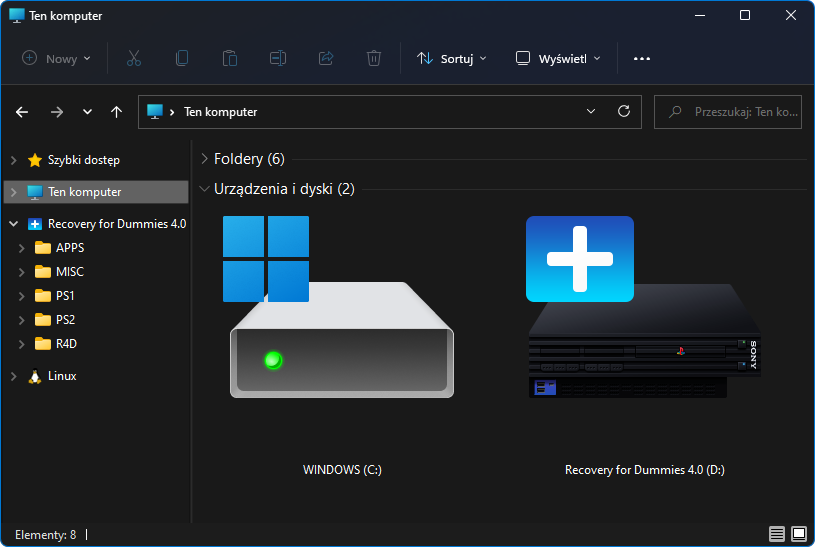
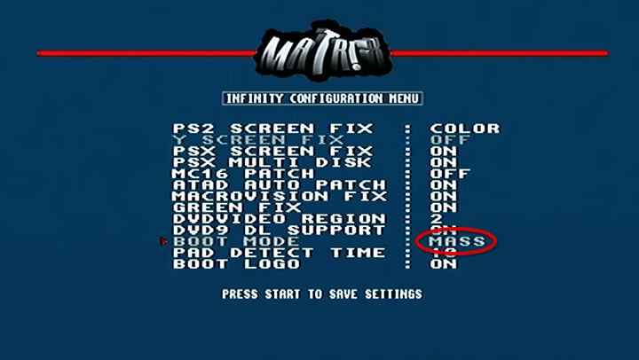
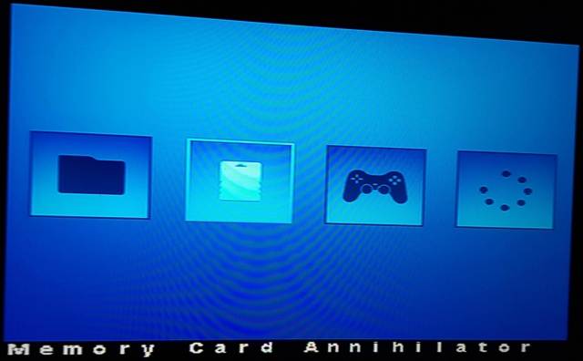

# How to Start the R4D from USB Stick

You can't. :) [Recovery for Dummies](https://www.psx-place.com/resources/recovery-for-dummies.1520/) (or **R4D** for short) is a collection of tools, not a standalone application. It relies on existing methods to replace the boot menu or automatically launch a special version of **OSDMenu**, which means it requires an already hacked console.

It is also very important to write the disk image to the USB stick correctly (see [How to Write the R4D Disk Image to a USB Stick.md](How%20to%20Write%20the%20R4D%20Disk%20Image%20to%20a%20USB%20Stick.html)). Otherwise, some features may not work properly.

**DESR** models do not have `rom0:OSDSYS`, so the OSDSYS patcher cannot be used on them. Instead, press **R1** to start **wLE R3Z**. Then, choose an application from `usb:/APPS/<application>/*.elf` to start it.

## Free McBoot & Free HDBoot

When you start **FMCB** or **FHDB** by any method (for example, as a **standalone application**, as a **System Update**, or via **OpenTuna**/**FunTuna**) with the R4D USB stick inserted, you should see the replaced menu. This happens because `usb:/FREEMCB.CNF` is used instead of the configuration file stored on your PS2 Memory Card or internal Hard Disk Drive.

**Note:** The R4D menu displays the actual version of the running FMCB for 1.9xx versions. For older versions, it displays `%VER%` because this parameter had not yet been implemented. This means that FMCB is 1.8c or older.

## PlayStation 2 Basic Boot Loader

When you start **PS2BBL** by any method (for example, as a **standalone application**, as a **System Update**, or via **LoadBOOTer**) with the R4D USB stick inserted, you should see the replaced menu. This happens because `usb:/PS2BBL/PS2BBL.INI` is used instead of the configuration file stored on your PS2 Memory Card or internal Hard Disk Drive, automatically launching **OSDM** (OSDMenu) with the embedded configuration (`usb:/APPS/OSDMenu/OSDMenu for R4D.elf`).

## PlayStation 2 Basic Boot Loader Extended

When you start **PS2BBLE** by any method, the INI file on the USB stick is not searched for, unlike with the PS2BBL application. If your `CONFIG.INI` is missing or corrupted, PS2BBLE allows you to start `usb:/RESCUE.ELF`. However, to avoid conflicts with FMCB, I did not include this file. Copy `usb:/APPS/OSDMenu/OSDMenu for R4D.elf` to `usb:/` and rename it to `RESCUE.ELF`. When PS2BBLE prompts you to start rescue mode, press the **R1** and **Start** buttons.

## Swap Magic

When you start **SM** by any method (for example, as a **standalone application** or from an original **optical disc**) with the R4D USB stick inserted, you should see the replaced menu. This happens because **OSDMenu** with the embedded configuration is launched from `usb:/SWAPMAGIC/SWAPMAGIC.ELF`.

**Swap Magic** must be version **3.6** or **3.8**, because version **3.3** does not support USB. Also, keep in mind that Swap Magic uses very old USB modules. They are quite picky, so many USB sticks may not be recognized or may not work properly.

## Dev.olution Mode 3

If your console has a **Modbo** modchip with the **DEV3** feature, you can configure it to boot automatically from **MASS** (the USB device). This works because the modchip launches its built-in firmware application loader, which reads the configuration from `usb:/system/config.txt`.

	
	 
	

 Berion 2026-08-17

<small>➜ Go back to <a href="{{ site.baseurl }}/">main page</a></small>

