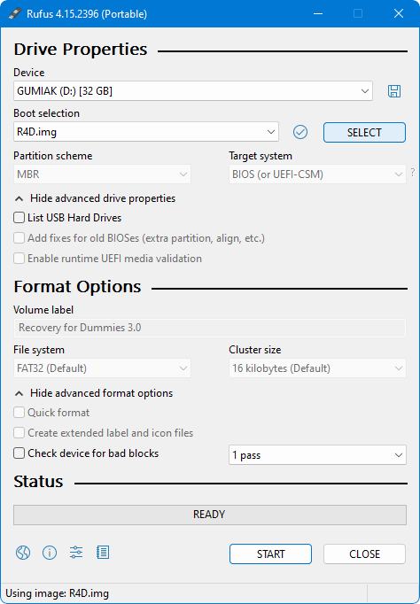

# How to Write the R4D Disk Image to a USB Stick

[Recovery for Dummies (R4D)](https://psx-place.com/resources/recovery-for-dummies.1520/) (or **R4D** for short) is distributed as a **disk image**, not a disc image. Therefore, it must be written directly to a USB stick -- it cannot simply be copied like a regular file.

The disk image already contains the required partition table, partition layout, and file system, so there is **no need to format the USB stick** beforehand. Whatever is currently stored on the USB stick will be overwritten during the writing process. **All existing data on the selected USB stick will be permanently erased.**

You can use any application capable of writing a disk image to a storage device sector by sector. This guide uses [Rufus](https://rufus.ie/en/) as an example because it is one of the most popular and easiest-to-use tools for this task (**Linux** users can use `dd` instead).

## Step A. Write the Disk Image

Start [Rufus](https://rufus.ie/en/) and configure the following options:

1. **Device:** Select the target USB stick from the list of detected devices. The minimum supported size is **1 GiB** (because the disk image was created for this size), and the maximum supported size is **2 TiB** (because the image uses an MBR partition table).
2. Click the **Select** button and choose the R4D disk image.
3. Click the **Start** button and wait until Rufus finishes writing the disk image.

## Step B. Extend the Partition

As you have probably noticed, after writing the disk image, the USB stick capacity is reduced to **1 GiB**. This is expected behavior.

If you want to use the remaining unallocated space on the USB stick, you can extend the partition. Unfortunately, this cannot be done using **Disk Management** (`diskmgmt.msc`) on Windows 8 or later, nor with Windows Explorer. Instead, use a third-party partition manager such as [AOMEI Partition Assistant](https://www.aomeitech.com/pa/download.html) or [GParted](https://gparted.org/download.php).

 Berion 2026-07-31

<small>➜ Go back to <a href="index.html">main page</a></small>

