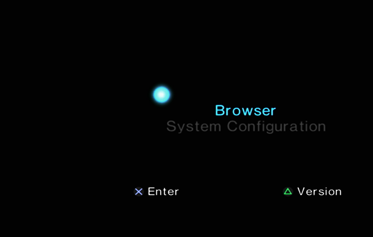

# R4D Troubleshooting

## USB Incompatibility

Not all USB sticks are compatible with the USB drivers used by various software on the PS2. Some are not detected at all, while others are detected, but the applications running on the PS2 cannot access external resources, causing them to freeze or behave unexpectedly.

While the USB standard is backward compatible, for unknown reasons, USB **3.0**/**3.1** devices have been reported to have lower compatibility with the PS2 than USB **2.0** and **1.1** devices.

## Black Screen

A black screen during startup of **Free McBoot** (FMCB) / **Free HDBoot** (FHDB) in versions 1.9xx (and sometimes 1.8b), most likely means that a modchip is installed in your console. If you do not see any Matrix, Toxic, or similar logo when turning on your PS2, this still does not mean that there is no modchip inside. It can even happen that someone who bought a console from a store is unaware that they actually purchased an already-modded PS2. With some modchips, FMCB/FHDB starts correctly, but launching any program results in a black screen.

If you are using FMCB/FHDB and intend to launch any program from the internal hard disk drive, use tools other than wLE ISR and wLE R3Z (e.g. uLE, wLE, or wLE kHn). Currently, these two applications somehow conflict with FMCB/FHDB (while they do not conflict with OSDM).

## RTC & CMOS

Some programs and games will not function correctly if the RTC (clock) settings start at the factory default date, as it may be used to trigger special events or initialize RNG. The clock also provides timestamps for save files, including a few edge cases where they are used for data validation.

An incorrect RTC date may occur due to a PS2 firmware bug. In this case, simply change the date to the current date (you can use **NTPS2** for this), save the settings, and restart the console. If the "firefly" is still dead (as shown in the screenshot below), instead of splitting and rotating, it means that the backup battery (**CR2032 3V**) needs to be replaced.

## VMODE

All homebrew programs will display in 480i resolution, but not all of them support 576i/576p. These include **Lens Changer** and **PS2HDDTester**.

Higher resolutions can only be achieved with a **component** or **VGA** cable (**HDMI converters** mostly use component as the video input). A **composite** cable on the PS2 cannot display more than 480i. This setting is stored in NVM, so keep in mind that OSDSYS will use it (although there is no guarantee that homebrew will respect this setting). If the TV does not support the selected mode, you will see a black screen. If you are not sure whether the target application and/or TV supports it, use the standard resolution.

 Berion 2026-09-12

<small>➜ Go back to <a href="index.md">main page</a></small>
